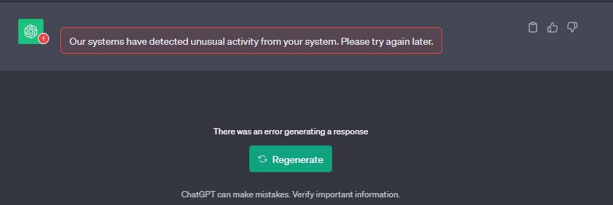

# Ask Chat GPT Chrome Extension

🚀 Hey everyone! Thrilled to unveil a handy tool I crafted in my free time 🚀

I noticed that I was frequently copying text from web pages to Chat GPT and thought there must be a more seamless way to do this. So, I whipped up a simple Chrome extension that lets you highlight text and directly send it to Chat GPT's input field, bypassing the copy-paste dance.

What made this project even more enjoyable was using Remotion. It's an innovative library that transforms React code into videos, essentially turning your code into a dynamic video editor. It made crafting a video guide for the extension a breeze!

👩‍💻 Extension Github Repo: https://github.com/BrianARuff/ask-chat-gpt-extension

🎥 YoutTube Video Guide (made with Remotion): https://www.youtube.com/watch?v=I8HxHOAuylY

📚 Video Guide Github Repo (Made with Remotion if you're interested in the code; it's a very simple project, just one file): https://github.com/BrianARuff/ask-chat-gpt-extension-video

I hope you find this small tool handy and enjoy the convenience it brings to your Chat GPT experience! Have you ever created something to solve a small annoyance in your daily workflow? Let me know your thoughts. 😊

## ** Updated Icons**

> Due to restrictions in OpenAI's Terms of Service, which prevent the use of their icons by third parties, we have updated our extension to feature new icons. We hope you like the fresh look! The green "chat-bot" icon next to the header above ("Updated Icons") is the new (32x32 pixel) icon.

## **🔒 Privacy Policy and Compliance Assurance**

> This application is designed with user privacy in mind and does not collect or store any personal information. Once your text is processed by Chat-GPT, it is promptly removed from any temporary storage. Furthermore, we have taken steps to ensure that the app aligns with Chat-GPT's terms of service. Lastly, we do not collect any user data. We temporarily store what you highlight in chrome's local storage, and then delete it as soon as it's pasted in to the Chat-GPT search textarea.

## **⚠️ Warning**

> You may encounter a message from Chat GPT stating, "Our systems have detected unusual activity from your system. Please try again later." or a similar alert. As of November 2, 2023, I have received this message approximately 10 times and continue to use my paid premium Chat-GPT account without issues. I **believe** this message is a precaution to ensure users are not bots, and clicking "try again" should resolve the issue. In my experience, it has always worked fine. While I don't anticipate OpenAI taking action against user accounts for this reason, I find it ethically important to inform you about the possibility of encountering this warning. Below is a screenshot of the warning message for reference. Chat GPT requires you to click the "Regenerate" button, and I've recently implemented a workaronud for this by calling `.click` on the "Regenerate" button, if it's found, and for now, at least, this seems to be working. If Open-AI updates the UI in the future, I"ll try and update the code with another workaround, if needed, that is.

