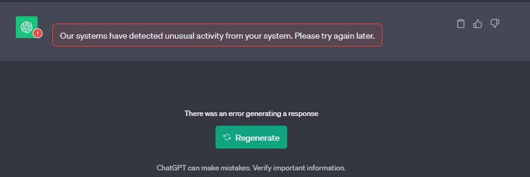

# Ask Chat GPT Chrome Extension - Beta Version

🚀 **Hey everyone!** I'm excited to share a tool I crafted in my free time. I noticed I was frequently copying text from web pages to Chat GPT, and thought there must be a more seamless way. So, I created a Chrome extension that lets you highlight text and send it directly to Chat GPT's input field.

**What made this project enjoyable** was using Remotion—an innovative library that transforms React code into videos. It made crafting a video guide for the extension a breeze!

- 👩‍💻 **Extension Github Repo:** [Ask Chat GPT Extension](https://github.com/BrianARuff/ask-chat-gpt-extension)
- 🎥 **YouTube Video Guide** (made with Remotion): [Watch here](https://www.youtube.com/watch?v=I8HxHOAuylY)
- 📚 **Video Guide Github Repo** (Made with Remotion): [Check out the code](https://github.com/BrianARuff/ask-chat-gpt-extension-video)

I hope you find this tool handy! Have you ever created something to solve a small annoyance in your workflow? Let me know your thoughts. 😊

## Updated Icons 🔄

> Due to restrictions in OpenAI's Terms of Service, we've updated our extension with new icons. The green "chat-bot" icon next to the header above is the new 32x32 pixel icon.

## Privacy Policy and Compliance Assurance 🔒

> This application prioritizes user privacy and doesn't collect or store personal information. Text is promptly removed from temporary storage after processing by Chat-GPT. The app aligns with Chat-GPT's terms of service, and we do not collect any user data. Highlighted text is temporarily stored in Chrome's local storage and deleted once pasted into Chat-GPT's search textarea.

## Warning ⚠️

> You may encounter a message from Chat GPT stating, "Our systems have detected unusual activity...". As of November 2, 2023, I've received this message ~10 times but continue to use my paid premium account without issues. Clicking "try again" should resolve the issue. While I don't anticipate OpenAI taking action against user accounts, it's ethically important to inform you about this warning.

### Update
> I have made recent updates to the extension source code that should prevent this from happening as often as it was previously. However, I can't guarentee that it will never show again, that said, I haven't seen it personally since making the update to the source code.

## To-Do List - Potential Future Features 📝

### 1. **Custom Lead-in Prompts**

> This feature allows users to craft their own lead-in statements for a personalized touch. For example, instead of a generic prompt like "Explain: '...your text here...'", users can create tailored prompts.

### 2. **Custom Version Inputs**

> From version 1.0.0, the extension attempts to utilize GPT-4.0, if available. If GPT-4.0 is not available, it defaults to using GPT-3.0. The proposed feature introduces an options interface for users to choose beta features, sub-types of GPT-4, and advanced data analytics capabilities. Users could also upload files for analysis.
